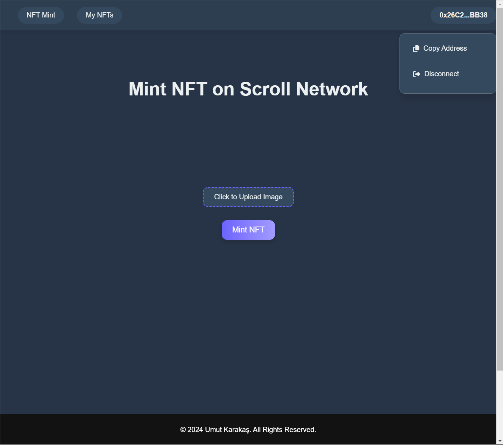
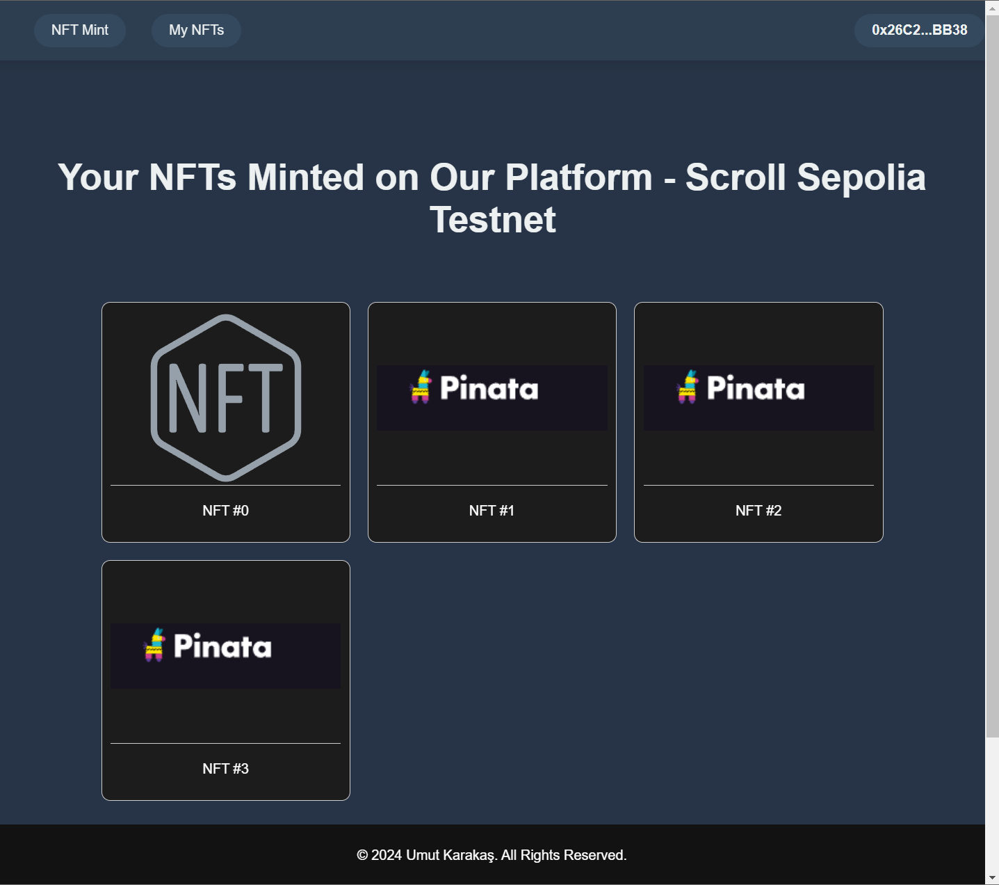
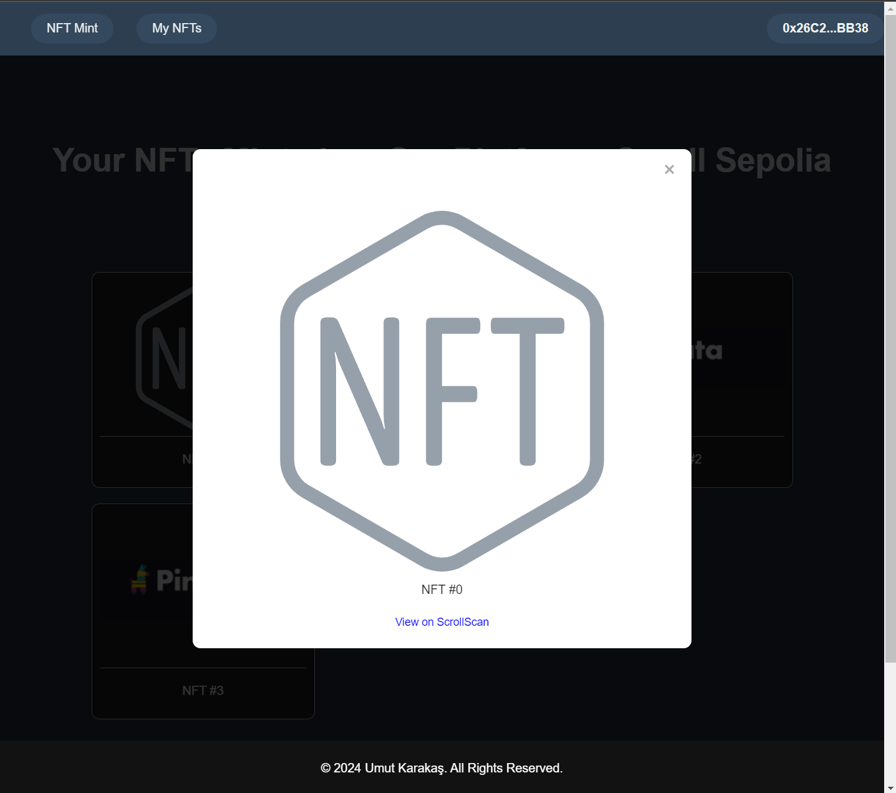

# NFT Mint App

This project enables users to mint NFTs on the Scroll Sepolia Testnet using a smart contract deployed on Ethereum. It provides a streamlined process for uploading images to IPFS via Pinata, minting NFTs with those images, and viewing minted NFTs on a dedicated page.

## Contract Address

The smart contract for minting NFTs is deployed at: `0x17E914af9245de9371C7D4F1963c5ea85A56b5A8`

You can view the contract details on Scroll Scan: [View Contract]([https://scrollscan.com/address/0x17E914af9245de9371C7D4F1963c5ea85A56b5A8](https://sepolia.scrollscan.com/address/0x17e914af9245de9371c7d4f1963c5ea85a56b5a8#code))

## Features

- **Mint NFTs:** Users can mint NFTs by uploading image metadata to IPFS using Pinata. The IPFS URL is then used to mint the NFT through the smart contract.
- **View Minted NFTs:** Users can view all NFTs they have minted on the "My NFTs" page, where they can see their collection.

## Usage

1. **Upload Image to IPFS:** Users upload their images to IPFS through Pinata. The resulting IPFS URL is required for the minting process.
   
2. **Mint NFT:** The NFT is minted by submitting the IPFS URL as metadata to the smart contract.

3. **View NFTs:** Users can navigate to the "My NFTs" page to see all NFTs they have minted using their connected wallet.

## Screenshots

Here are some screenshots of the application:

1. **Homepage:**
   

2. **Mint NFT Page:**
   

3. **My NFTs Page:**
   

4. **NFT Details Page:**
   

## Technologies Used

- **web3js**
- **etherjs**
- **reactjs**

The Solidity code for the NFT smart contract can be found in the `NFT.sol` file.

## Optional Setup

Hardhat setup was completed for this project and can be optionally used by users for further development.

## Notes

- Ensure MetaMask is connected to the Scroll Sepolia Testnet to interact with the smart contract.
- For detailed instructions on integrating with Pinata and IPFS, refer to their official documentation.

## License

This project is licensed under the MIT License - see the [LICENSE](LICENSE) file for details.
